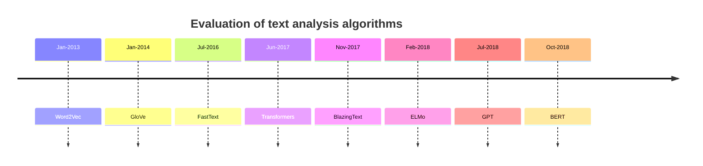

- Natural language processing is a branch of AI that provides machines the ability to understand and analyse Human Language as the same way as the human beings do. Examples: Spell check, Auto complete, Spam Detection, Alexa or Google Assistants.
- corpus: a large collection of natural language text, A corpus may be a collection of books, newspaper articles, research papers, theatrical plays, or blog posts or a mix of these.
# Steps in NLP
## Pre-Processing
- This is the first step while working in NLP.
- It is a multi-step process which starts from Tokenization
### Tokenization
- One of the most important step in text Pre-Processing.
- the process of splitting a phrase, sentence, paragraph, one or multiple text documents into smaller units. 🔪 Each of these smaller units is called a **token**. Now, these tokens can be anything — a word, a subword, or even a character. Different algorithms follow different processes in performing tokenization
- **“Let us learn tokenization.”**
- Word based tokenization algorithm: break the sentence into words. The most common one is splitting based on space. ie - [“Let”, “us”, “learn”, “tokenization.”]
- subword-based tokenization algorithm:  break the sentence into subwords. this solves  issues faced by word-based tokenization (very large vocabulary size, large number of OOV tokens, and different meaning of very similar words) and character-based tokenization (very long sequences and less meaningful individual tokens). ie-[“Let”, “us”, “learn”, “token”, “ization.”]
- character-based tokenization algorithm: Break the sentence into characters. ie - [“L”, “e”, “t”, “u”, “s”, “l”, “e”, “a”, “r”, “n”, “t”, “o”, “k”, “e”, “n”, “i”, “z”, “a”, “t”, “i”, “o”, “n”, “.”]
- A few common subword-based tokenization algorithms are [WordPiece](https://arxiv.org/pdf/1609.08144v2.pdf) used by [BERT](https://arxiv.org/pdf/1810.04805.pdf) and [DistilBERT](https://arxiv.org/pdf/1910.01108.pdf), [Unigram](https://arxiv.org/pdf/1804.10959.pdf) by [XLNet](https://arxiv.org/pdf/1906.08237.pdf) and [ALBERT](https://arxiv.org/pdf/1909.11942.pdf), and [Bye-Pair Encoding](https://arxiv.org/pdf/1508.07909.pdf) by [GPT-2](https://cdn.openai.com/better-language-models/language_models_are_unsupervised_multitask_learners.pdf) and [RoBERTa](https://arxiv.org/pdf/1907.11692.pdf).

- Tokens are actually the building blocks of NLP and all the NLP models process raw text at the token level. These tokens are used to form the vocabulary, which is a set of unique tokens in a corpus (a dataset in NLP). This vocabulary is then converted into numbers (IDs) and helps us in modeling.
- 

### Removing Stop words
- this include remove of stop words like the, a, an which may not be impactful on the overall model performance.
### Feature Extraction
Map your textual data to vectors like
- [[Bag of Words]]
- [[TFIDF]]
### Encoding of the Labels
- [[One Hot Encoding]]
### Checking [[class imbalance]]

# Text Analysis

- [Word2Vec algorithm](https://arxiv.org/pdf/1301.3781.pdf)
- [GloVe algorithm](https://www.aclweb.org/anthology/D14-1162.pdf)    
- [FastText algorithm](https://arxiv.org/pdf/1607.04606v2.pdf)    
- [Transformer architecture, "Attention Is All You Need"](https://arxiv.org/abs/1706.03762)    
- [BlazingText algorithm](https://dl.acm.org/doi/pdf/10.1145/3146347.3146354)
- [ELMo algorithm](https://arxiv.org/pdf/1802.05365v2.pdf)    
- [GPT model architecture](https://cdn.openai.com/research-covers/language-unsupervised/language_understanding_paper.pdf)    
- [BERT model architecture](https://arxiv.org/abs/1810.04805)    
- [Built-in algorithms](https://docs.aws.amazon.com/sagemaker/latest/dg/algos.html)  
- [Amazon SageMaker BlazingText](https://docs.aws.amazon.com/sagemaker/latest/dg/blazingtext.html)