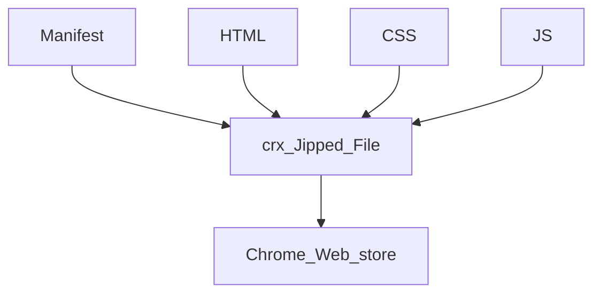

# Introduction
- Small programs
- Modify DOM of a web page
- HTML, CSS & Java Script

# Tutorial Structure
- Hello world Extension
- Browser Action Extension
- Page Action Extension
- Neither BA or PA
- Debug
- Deploy

# The Big Picture

# Extension Types
- Browser Action - Hello World
	- Stay in tool bar
	- Accessible at all time
- Page Action
	- Stay in tool bar grey-ed out.
	- Accessible only on certain pages
- Neither BA or PA action
	- Run in the background

# Manifest
- Information about the extension
- JSON format
- Mandatory
	- Manifest Version
	- Name of the ext
	- Version of the ext

# HTML
- This will represent the UI of the extension

Reference:
- [API reference - Chrome for Developers](https://developer.chrome.com/docs/extensions/reference/)
- [Chrome Extensions 101 - Chrome for Developers](https://developer.chrome.com/docs/extensions/mv3/getstarted/extensions-101/)
- https://stackoverflow.com/questions/16503879/chrome-extension-how-to-open-a-link-in-new-tab
- chrome://extensions/
- 