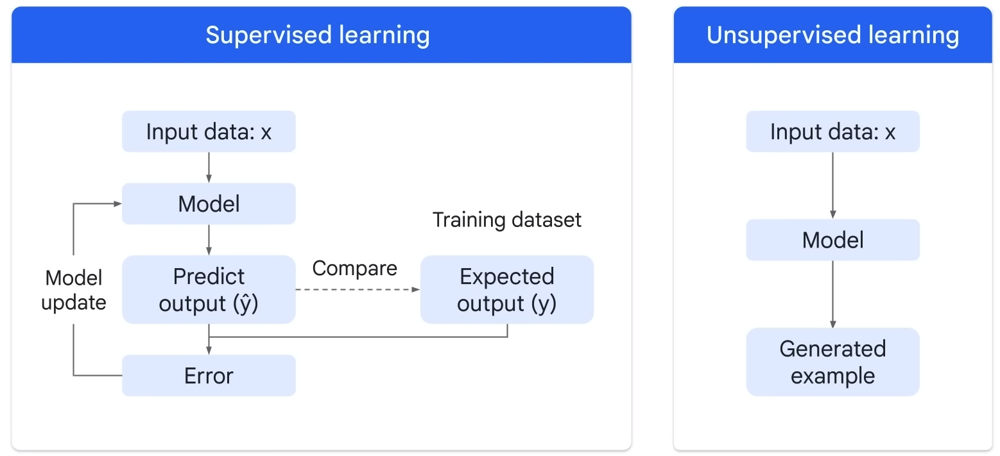
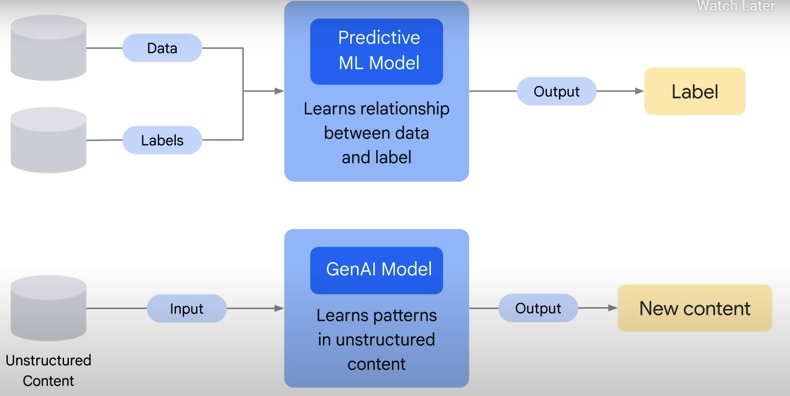

- _AI_: It is a Discipline, AI is the theory and development of computer systems able to perform tasks normally requiring human intelligence
	- _Machine Learning_: ML gives computers the ability to learn without explicit programming, it is a subfield of AI, it is a system that trains a model from input data, and make useful prediction from the seen or unseen data to draw insight.
		- _Supervised ML Models_:
			- implies the data is already labeled.
			- Here we are learning from past examples to predict future values.
		- _Unsupervised ML Models_
			- Implies the data is not labeled.
			- Unsupervised problems are all about looking at the raw data, and seeing if it naturally falls into groups
		  - _Reinforcement Learning_
		  - _Deep Learning_:
			  - Uses [[Artificial Neural Networks]] - allowing them to process more complex patterns than traditional machine learning.
			  - Deep Learning Models Types:
				  - _Discriminative_
					  - Used to classify or predict
					  - Typically trained on a dataset of labeled data
					  - Learns the relationship between the features of the data points and the labels.
				  - _Generative_
					  - Generates new data that is similar to data it was trained on
					  - Understand distribution of data and how likely a given example is
					  - Predict next word in a sequence
			  - _Generative AI_
				  - A subset of Deep Learning	
				  - GenAI is a type of artificial intelligence that creates new content based on what it has learned from existing content.
				  - The process of learning from existing content is called training and results in the creation of a statistical model.
				  - when given a prompt, GenAI, uses this statistical model to predict what an expected response might be and this generates new content.
				  - Generative Models Type
					  - _Generative Language Models_
						  - Generative language models learn about patterns in language through training data.
						  - Then, Given some text, they predict what comes next.
					- _Generative Image Models_
						- Generative Image Models produce new images using techniques like diffusion. Then, Given a prompt or related imagery, they transform random noise into images or generate images from prompts.
			  - _Large Language Models_
				  - A Subset of Deep Learning 
			- _Foundation Models_
				- A large AI model pretrained on vast quantity of data( which can include: Text, Image, Speech, Structured Data, 3D Signals etc) design to be adaptive or finetuned to a wide range of downstream tasks such as Question Answering, Sentiment Analysis, Information extraction, Image Captioning, Object recognition, Instruction following 
- Not a GenAI when Output is:
	- Number
	- Discrete
	- Class
	- Probability
- Is a GenAI when Output is:
	- Natural Language
	- Image
	- Audio
- ML Vs GenAI Model Pipeline!

